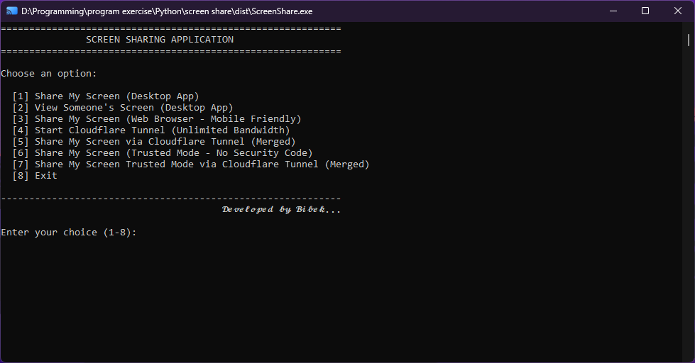
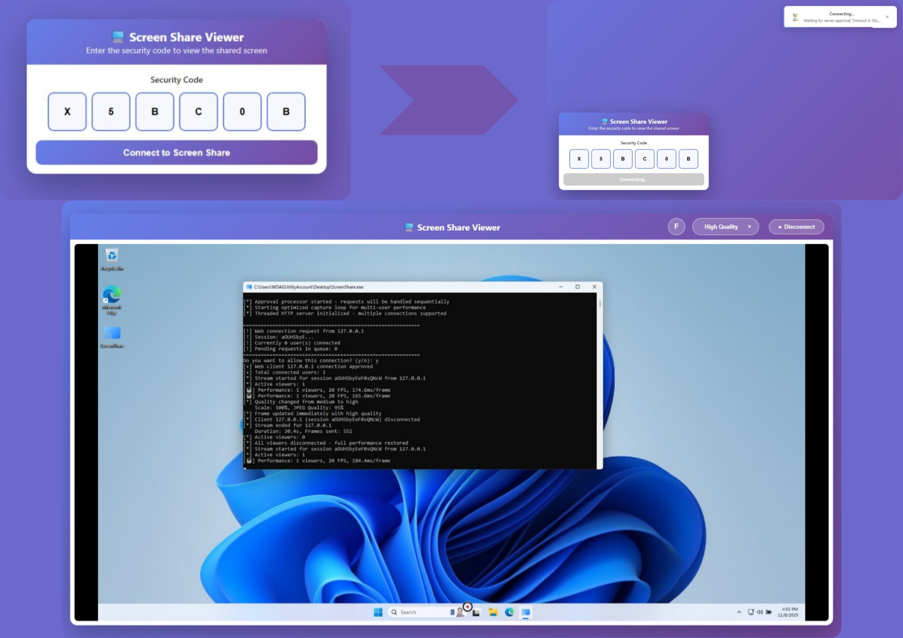

# Real-Time Screen Sharing Application

A Python-based screen sharing application with security code authentication and advanced web viewing features. Share your screen securely with others in real-time with professional quality!

## 🎯 Quick Download

**⬇️ Download Ready-to-Use EXE File:**
**[📥 Download Latest Release](https://github.com/bibekchandsah/screenshare/releases)**

- 🚀 **No Python Required** - Just download and run!
- 📦 **Portable** - No installation needed
- 🔒 **Safe** - Windows Defender may show warning (false positive)
- 💾 **Size** - ~85-100 MB optimized build

## 📸 Application Preview




*Real-time screen sharing with modern web interface, mobile-friendly design, and professional quality streaming*

## Features

### Core Features
- 🔒 **Secure Connection**: Random security code generation + manual approval system
- 📺 **Real-time Streaming**: Live screen capture and streaming at high quality
- 🚀 **Easy to Use**: Simple menu-driven interface
- 🔌 **Network Support**: Works over LAN, localhost, and **internet** (with Cloudflare Tunnel/ngrok)
- 🌐 **Remote Access**: Share screen across different networks/locations
- 👥 **Multiple Viewers**: Support for unlimited simultaneous viewers
- 🎯 **Unified Launcher**: Single entry point with menu options
- 🖱️ **Cursor Visibility**: See the presenter's mouse cursor in real-time

### Advanced Web Features (NEW! ✨)
- 📱 **Mobile Friendly**: Responsive design works on phones, tablets, and desktops
- 🖼️ **High Quality**: 100% resolution at 95% JPEG quality for crystal-clear viewing
- 🔍 **Interactive Zoom**: Click to zoom into any section, drag to pan around
- 🎬 **Fullscreen Mode**: Immersive viewing with draggable controls
- ⌨️ **Keyboard Shortcuts**: F key for fullscreen, Esc to exit
- 🎨 **Modern UI**: Clean, professional interface with individual digit input boxes
- 📢 **Toast Notifications**: Real-time status updates for all events
- 🔌 **Connection Monitoring**: Automatic disconnection detection
- ⚡ **Smooth Performance**: 20 FPS streaming with optimized JPEG encoding
- 🎮 **Touch Support**: Full touch gesture support for mobile devices

### Dynamic Quality Control (NEW! 🎯)
- 🎚️ **Interactive Quality Button**: Click to adjust quality anytime during viewing
- 📊 **Three Quality Levels**: HIGH (best), MEDIUM (balanced), LOW (fast)
- 🔄 **Real-Time Switching**: Change quality instantly without reconnection
- 🎨 **Visual Dropdown Menu**: Intuitive GUI in top-right corner of viewer
- 🌐 **Adaptive Streaming**: Adjust quality based on your network speed
- 💾 **Smart Defaults**: Starts at MEDIUM quality, perfect for most users
- ⚡ **Client-Side Scaling**: Server sends high quality, client scales as needed
- 📱 **Responsive Window**: Fully resizable viewer with quality overlay

### System Tray Integration (NEW! 🎮)
- 📌 **System Tray Icon**: Minimalist icon in your taskbar notification area
- 🎛️ **Quick Menu Access**: Right-click icon for instant menu access
- 👁️ **Hide/Show Window**: Toggle console window visibility on-the-fly
- 🔄 **Restart Application**: Quick restart without closing
- 🌐 **Developer Link**: Direct access to developer's website
- 🐙 **Contribute Link**: Quick link to GitHub repository for reporting issues
- ❌ **Clean Exit**: Proper shutdown with no errors or hanging processes

### Security Features
- 🔐 **Two-Factor Security**: Security code + manual server approval
- 🛡️ **Session Management**: Unique session IDs for each connection
- 📋 **Queue System**: Sequential approval processing for multiple requests
- 🚫 **Thread-Safe**: Race condition prevention with proper locking

## 📋 System Requirements

- ✅ **Python** 3.7 or higher
- ✅ **OS:** Windows 10|11/Linux/macOS (64-bit)
- ✅ **RAM:** 4 GB minimum
- ✅ **Disk:** 100 MB free space
- ✅ **Network:** Local network or internet connection
- ✅ **Python:** **NOT REQUIRED!** (Built-in)

## Installation

1. **Clone or download this repository**

2. **Install required packages:**
   ```bash
   pip install -r requirements.txt
   ```

## Usage

### Quick Start (Recommended)

Simply run the main application and choose what you want to do:

```bash
python main.py
```

You'll see a menu with eight options:

```
============================================================
              SCREEN SHARING APPLICATION
============================================================

Choose an option:

  [1] Share My Screen (Desktop App)
  [2] View Someone's Screen (Desktop App)
  [3] Share My Screen (Web Browser - Mobile Friendly)
  [4] Start Cloudflare Tunnel (Unlimited Bandwidth)
  [5] Share My Screen via Cloudflare Tunnel (Merged)
  [6] Share My Screen (Trusted Mode - No Security Code)
  [7] Share My Screen Trusted Mode via Cloudflare Tunnel (Merged)
  [8] Exit
------------------------------------------------------------

Enter your choice (1-8):
```

#### Option 1: Share My Screen (Desktop App)
**This option works under both user is connected under same wifi**
1. Select option **1** from the menu
2. Your screen will be captured and displayed in a new desktop window
3. A **security code** will be generated and displayed (e.g., `ABC123`)
4. Note the server details for viewers to connect (e.g., SERVER IP: `10.5.234.63`)
5. Viewers can connect using Option 2 (desktop app) with the security code
6. Press `Q` key or `ESC` to stop sharing and return to menu

**Benefits:**
- ✅ Desktop-to-desktop connection
- ✅ Direct screen capture display
- ✅ High quality streaming
- ✅ Secure (code-protected)
- ✅ High performance for local networks

**Example Output:**
```
🖥️  SHARE MY SCREEN MODE
============================================================

[*] Press Ctrl+C to stop sharing


============================================================
🔐 SECURITY CODE: XMP7MG
📡 SERVER IP: 10.5.234.63
🔌 PORT: 5555
============================================================
📤 Share this information with the viewer:
   IP Address: 10.5.234.63
   Security Code: XMP7MG
============================================================

[*] Server listening on 0.0.0.0:5555
[*] Starting optimized screen capture loop...
[*] Waiting for connections...
[*] Starting optimized capture loop for multi-user performance
```

#### Option 2: View Someone's Screen (Desktop App)

1. Select option **2** from the menu
2. Enter the required information when prompted:
   - **Server IP address**: 
     - Use `localhost` or `127.0.0.1` if viewing on the same PC
     - Use the actual IP address if connecting from another PC (e.g., `192.168.1.100`)
   - **Port**: Press Enter for default (5555) or enter custom port
   - **Security code**: Enter the 6-character code provided by the person sharing
3. Wait for server approval
4. If approved, you'll see the shared screen in a new desktop window
5. Press `Q` key or `ESC` to quit viewing and return to the menu

**Example:**
```
👀 VIEW SOMEONE'S SCREEN MODE
============================================================

Enter server IP address (or 'localhost' for same PC): localhost
Enter server port (default: 5555): 
Enter the security code: XGFRDW

------------------------------------------------------------
[+] Successfully connected to server!
[*] Receiving screen feed...
[*] Press 'q' to quit
```

#### Option 3: Share My Screen (Web Browser - Mobile Friendly)

**Perfect for viewing on mobile phones, tablets, or any device with a browser under same wifi!**

1. Select option **2** from the menu
2. A **security code** will be generated and displayed
3. Press C to **copy the security code to clipboard**, or any other key to skip:
4. The application will show URLs to access the screen share:
   ```
   Access the screen share from your browser at:
       http://192.168.1.100:5000
       http://localhost:5000
   ```
5. **On your mobile phone or any device:**
   - Make sure it's connected to the **same WiFi network** as your PC
   - Open a web browser (Chrome, Safari, Firefox, etc.)
   - Enter the URL shown (e.g., `http://192.168.1.100:5000`)
   - Enter the security code in individual digit boxes (auto-focus, paste support)
   - Wait for server approval
   - View the screen in real-time with high quality!

6. Press `Ctrl+C` on the server to stop sharing
7. For sharing screen over the internet sharing open new terminal and choose option **4**

**Web Browser Features:**
- ✅ **Responsive Design**: Works perfectly on any screen size
- ✅ **Touch-Friendly Interface**: Optimized for mobile gestures
- ✅ **No App Installation**: Just open a browser
- ✅ **High Quality**: 100% resolution at 95% JPEG quality
- ✅ **Interactive Zoom**: 
  - Click anywhere to zoom into that section
  - Drag to pan when zoomed in
  - Click again to zoom out
- ✅ **Fullscreen Mode**: 
  - Double-click the F button to enter fullscreen
  - Drag the F button anywhere on screen
  - Press F key or Esc key to exit
  - Double-click F button again to exit
- ✅ **Keyboard Shortcuts**:
  - `F` key → Toggle fullscreen mode
  - `Esc` key → Exit fullscreen mode
- ✅ **Individual Digit Boxes**: Easy code entry with paste support
- ✅ **Toast Notifications**: Real-time status updates
- ✅ **Connection Monitoring**: Auto-detects server disconnection
- ✅ **Smooth Streaming**: 20 FPS for fluid motion
- ✅ **Multi-User Support**: Unlimited simultaneous viewers
- ✅ **Cross-Platform**: Works on iOS, Android, Windows, macOS, Linux

**Example Output:**
```
🌐 WEB BROWSER SCREEN SHARE MODE
============================================================

============================================================
SECURITY CODE: XK9M2P
============================================================
Share this code with the person who wants to view your screen
Multiple viewers can connect simultaneously!
============================================================

[*] Access the screen share from your browser at:
    http://192.168.1.100:8080
    http://localhost:8080

[*] Server starting on 0.0.0.0:8080
[*] Multi-user support enabled
[*] Approval processor started - requests will be handled sequentially
[*] Press Ctrl+C to stop sharing
```

#### Option 4: Start Cloudflare Tunnel (Unlimited Bandwidth)
**Share your screen over the internet using Cloudflare tunnels for web browser access**
1. Select option **4** from the menu
2. Choose option **1** for Quick Tunnels (Recommended)
3. Choose option **1** for Web Mode
4. Cloudflare tunnel will start automatically
5. You'll receive a public URL (e.g., `https://random-name.trycloudflare.com`)
6. This establishes the tunnel infrastructure for screen sharing
7. Share this URL with anyone worldwide!
8. They can access your screen through their web browser
9. Use this in combination with other options for internet access (Option 3 & 6)
10. Press Ctrl+C to stop the tunnel

**Example:**
```
🌐 CLOUDFLARE TUNNEL
============================================================

[*] Starting Cloudflare tunnel...
[*] Tunnel URL: https://quick-fox-123.trycloudflare.com
[*] Tunnel established successfully
[*] Ready for screen sharing over internet
[*] Press Ctrl+C to stop tunnel
```

**Benefits:**
- ✅ Share over internet (not just LAN)
- ✅ No port forwarding needed
- ✅ Unlimited bandwidth
- ✅ Works from anywhere
- ✅ Mobile-friendly

#### Option 5: Share My Screen via Cloudflare Tunnel (Merged)

1. Select option **5** from the menu
2. This combines screen sharing with Cloudflare tunnel in one step
3. You'll receive both a security code and public URL
4. Cloudflare public URL will be automatically copied to clipboard
5. Press **c** to copy the security code to clipboard
6. Share both URL and code with viewer
7. They can access from anywhere with internet
8. Security code still required for approval
9. Press Ctrl+C to stop sharing

**Example:**
```
🌐 CLOUDFLARE TUNNEL + SCREEN SHARE (MERGED)
============================================================

[*] 🚀 Starting Cloudflare Tunnel...
[*] 🌐 Public URL: https://bright-star-456.trycloudflare.com
[*] Security code: ABCD12
[*] Share both URL and code with viewer
[*] Press Ctrl+C to stop sharing
```

**Benefits:**
- ✅ Direct TCP connection
- ✅ Lower latency than HTTP
- ✅ Internet access via Cloudflare
- ✅ No bandwidth limits

#### Option 6: Share My Screen (Trusted Mode - No Security Code)
**Share your screen without requiring security codes - perfect for trusted environments. (under same wifi)**
1. Select option **6** from the menu
2. Your screen starts sharing immediately without security code
3. The server shows your IP address (e.g., `192.168.1.100:8080`)
4. Anyone on your network can connect by entering the IP in their browser
5. Use only in trusted environments (home network, trusted colleagues)
6. Quality controls (High/Medium/Low) work the same way
7. Press Ctrl+C to stop sharing
**⚠️ Security Note:** Only use in trusted environments!

**Example:**
```
🔓 TRUSTED MODE (NO SECURITY CODE)
============================================================

[*] Server starting on 0.0.0.0:8080
[*] Trusted mode - no approval required
[*] Connect with: http://192.168.1.100:8080
[*] Press Ctrl+C to stop sharing
```

**Benefits:**
- ✅ No security code hassle
- ✅ Instant access for trusted users
- ✅ Perfect for family/team sharing
- ✅ Same high-quality streaming

#### Option 7: Share My Screen Trusted Mode via Cloudflare Tunnel (Merged)
**Combines Cloudflare internet access with trusted mode for the easiest possible sharing. (worldwide access)**
1. Select option **7** from the menu
2. Combines Cloudflare tunnel with trusted mode
3. You'll receive a public URL that anyone can access directly
4. URL will be copied automatically to clipboard
5. No approval needed - immediate access for anyone with the link
6. Use with extreme caution - only for very trusted recipients
7. Press Ctrl+C to stop sharing
**⚠️ Security Note:** URL access grants immediate screen viewing!

**Example:**
```
🌐 CLOUDFLARE + TRUSTED MODE
============================================================

[*] Starting Cloudflare tunnel...
[*] Public URL: https://red-moon-789.trycloudflare.com
[*] TRUSTED MODE: No security code required
[*] Anyone with this URL has immediate access
[*] Press Ctrl+C to stop sharing
```

**Benefits:**
- ✅ Internet access via Cloudflare
- ✅ No security codes needed
- ✅ Easiest sharing method
- ✅ Perfect for demonstrations

#### Option 8: Exit
Safely close the application.
Closes the application with confirmation.


### **Tips for Mobile Viewing:**
- ✅ Use the same WiFi network
- ✅ Use landscape mode for better viewing
- ✅ Double-click F button or use F key for fullscreen
- ✅ Click on any area to zoom in, drag to pan
- ✅ Stable connection = smoother streaming
- ✅ Close unnecessary apps on phone for better performance
- ✅ Use paste functionality for quick code entry (long-press in code box)

### **Web Interface Controls:**

**Zoom Features:**
- **Click to Zoom**: Click anywhere on the screen to zoom into that exact section
- **Drag to Pan**: When zoomed, drag with mouse/finger to move around
- **Click to Zoom Out**: Click again to return to fit-to-screen view

**Fullscreen Features:**
- **Enter Fullscreen**: 
  - Double-click the F button in header
  - OR press F key on keyboard
- **Exit Fullscreen**: 
  - Press Esc key
  - OR press F key again
  - OR double-click the draggable F button
- **Move F Button**: Drag the F button to any position when in fullscreen

**Keyboard Shortcuts:**
- `F` → Toggle fullscreen mode (when viewing screen)
- `Esc` → Exit fullscreen mode (when in fullscreen)

## 💡 Tips & Tricks

### Tip 1: Easy Internet Sharing

For the simplest internet sharing experience:

**Single Step:**
```
Run ScreenShare.exe
Choose [7] (Cloudflare + Trusted)
Share the URL - that's it!
```

### Tip 2: Secure Internet Sharing

For secure internet sharing with authentication:

**Two Steps:**
```
1. Run ScreenShare.exe
2. Choose [5] (Cloudflare HTTP)
3. Share URL and security code
```

---

### Tip 3: Mobile Viewing

All sharing modes work great on mobile!

**Perfect for:**
- ✅ Phones
- ✅ Tablets
- ✅ Any device with browser

**Best options for mobile:**
- Option [5] (regular mode)
- Option [6] (trusted mode - no code needed)
- Option [7] (Cloudflare + trusted for internet)

---

### Tip 4: Quick Same-PC Test

**Test everything works:**
1. Run ScreenShare.exe
2. Choose [3] (Share My Screen)
3. Open browser
4. Go to `http://localhost:5000`
5. Enter security code
6. Should see your screen!

**Test trusted mode:**
1. Run ScreenShare.exe
2. Choose [6] (Trusted Mode)
3. Open browser
4. Go to `http://localhost:5000`
5. No code needed - instant access!

---

### Tip 5: Share Multiple Screens

Want to share to multiple viewers?

**All modes support multiple viewers:**
- ✅ Multiple viewers can connect simultaneously
- ✅ Each enters same security code (except trusted mode)
- ✅ All see your screen

**Recommendation:** 
- Use trusted mode (option [5]) for easy multiple access
- Use Cloudflare + trusted (option [7]) for internet sharing to multiple people

---

## 🌐 Sharing Across Different Networks (Internet Access)

### Problem: Same WiFi Limitation
By default, screen sharing only works when both users are on the **same WiFi/local network**. But what if you want to share with someone in a different location?

### Solution: Remote Access Options
- Choose option **5** (for secure connection)
- Choose option **7** (for trusted user)
- We are using **Cloudflare** for remote access

#### **Cloudflare Tunnel (Best Performance, Unlimited Bandwidth) 🚀**

**Why Cloudflare? Superior Choice:**
- 🌐 **No Bandwidth Limits** (ngrok has monthly limits)
- ⚡ **Enterprise Performance** (Cloudflare's global CDN)
- 👥 **Multiple Users** (perfect for multi-user optimization)
- 🆓 **Completely Free** (no subscription required)
- 🔒 **More Secure** (enterprise-grade infrastructure)
- 💰 **No Monthly Fees** (completely free)

---

## Network Requirements Summary

### Same Location (Same WiFi):
```bash
# Just use options 1 & 2 or 3 directly
python main.py → 1  # Server
python main.py → 2  # Client
python main.py → 3  # Server
```

### Different Locations:
```bash
# Use Cloudflare Tunnel (Recommended)
python main.py → 5/7  # Server or 👇
python cloudflare_helper.py  # Setup tunnel first
python main.py → 3          # Server (use tunnel URL)
```

**Yes, your application supports cross-location screen sharing! 🎉**

The **Cloudflare Tunnel integration** provides unlimited bandwidth and better performance for multiple users.

---

## Quick Reference

| Scenario | Server Steps | Client Steps |
|----------|--------------|--------------|
| **Same WiFi** | `main.py → 1` | `main.py → 2` |
| **Same WiFi** | `main.py → 3` | `URL & Security Code` |
| **Different WiFi (Cloudflare)** | `main.py → 5/7` | `URL & Security Code` |
| **Different WiFi (Cloudflare)** | `cloudflare_helper.py` | Use Cloudflare URL |

---

### Alternative Usage (Advanced)

You can also run the server and client directly if you prefer:

#### Run Server Only:
```bash
python server.py
```

#### Run Client Only:
```bash
python client.py
```

## Network Setup

### For Same PC Testing
- Server IP: `localhost` or `127.0.0.1`
- No firewall configuration needed

### For Different PCs on the Same Network

1. **Find the server PC's IP address:**
   - **Windows**: Open Command Prompt and type `ipconfig`
   - **Linux/Mac**: Open Terminal and type `ifconfig` or `ip addr`
   - Look for the IPv4 address (e.g., `192.168.1.100`)

2. **Configure Firewall (if needed):**
   - Allow incoming connections on port 5555 (Desktop) or 8080 (Web)
   - **Windows Firewall**: 
     - Open Windows Defender Firewall
     - Click "Advanced settings"
     - Create new Inbound Rule for port 5555 and/or 8080

3. **Connect:**
   - Desktop Client: Enter the server's IP address when prompted
   - Web Browser: Navigate to `http://SERVER_IP:8080`

## Configuration

You can customize the following settings by editing the source code:

### Main Menu (`main.py`)
- Main entry point for the application
- Handles user interface and navigation
- Imports and runs server, web server, or client based on user choice

### Server (`server.py`)
- **Port**: Change `port=5555` in the `ScreenShareServer` initialization
- **Code Length**: Change `length=6` in `generate_security_code()` method
- **Image Quality**: Adjust `scale_percent` (around line 58) and JPEG quality (around line 64)
  - Lower values = better performance, lower quality
  - Higher values = worse performance, better quality

### Web Server (`web_server.py`) 
- **Port**: Change `port=8080` in the `ScreenShareWebServer` initialization
- **Code Length**: Change `length=6` in `generate_security_code()` method
- **Image Quality**: 
  - Adjust `scale_percent` (currently 100% for maximum quality) in `capture_screen_loop()`
  - Adjust JPEG quality (currently 95 for excellent quality)
  - Line 62-65: JPEG encoding parameters
- **Frame Rate**: Adjust `time.sleep(0.05)` for different FPS (currently 20 FPS)
- **Interpolation**: Uses `cv2.INTER_LANCZOS4` for best quality when scaling
- **Progressive JPEG**: Enabled for better streaming performance

### Web Server Trusted (`web_server_trusted.py`)🆕
- 🔓 **No Security Code Required**: Provides screen sharing without authentication prompts
- 🌐 **Web Browser Access**: Viewers can connect instantly via any web browser
- ✅ **Trusted Environment**: Perfect for home networks, family sharing, or trusted colleagues
- 🚀 **Instant Access**: No approval process - immediate connection once URL is accessed
- 📱 **Mobile Friendly**: Same responsive design as regular web server
- 🎯 **Quality Controls**: Supports High/Medium/Low quality settings with persistent storage
- 🔒 **Local Network**: Designed for trusted local networks (not for public internet)

**When to use:**
- ✅ Family members accessing your screen
- ✅ Trusted team meetings or presentations  
- ✅ Demo environments where security isn't a concern
- ✅ Quick screen sharing without authentication hassle
- ❌ **NOT for public/untrusted networks** (no security protection)

**Quality Settings Explained:**
- `scale_percent = 100`: Full resolution (100% of original)
- `JPEG_QUALITY = 95`: Near-lossless compression
- `JPEG_OPTIMIZE = 1`: Optimize file size
- `JPEG_PROGRESSIVE = 1`: Progressive rendering for web
- `INTER_LANCZOS4`: Highest quality interpolation algorithm

### Client (`client.py`)
- Default port can be changed in the main() function

## Performance Tips

1. **Reduce Screen Resolution**: The server automatically scales to 60% of original size
2. **Adjust Quality**: Lower JPEG quality in `server.py` for faster streaming
3. **Close Unused Applications**: Free up system resources
4. **Use Wired Connection**: Better than WiFi for smoother streaming

## Troubleshooting

### Connection Refused
- Make sure the server is running before starting the client
- Check if the IP address is correct
- Verify firewall settings
- If using `main.py`, ensure you select option 1 (Share) on server PC first

### Unauthorized Error
- Double-check the security code (it's case-sensitive, but automatically converted to uppercase)
- Make sure you're entering the current code from the active server session
- Verify you're copying the complete 6-character code
- Check debug output to see what codes are being compared

### Poor Performance / Lag
- Reduce the image quality in `server.py` (lower `scale_percent` and JPEG quality)
- Close bandwidth-heavy applications on both PCs
- Check network connection speed
- Use wired Ethernet instead of WiFi for better stability

### Black Screen or No Display
- Verify screen capture permissions (especially on macOS)
- Try running with administrator/sudo privileges
- Check if `mss` library is properly installed
- Ensure OpenCV (`cv2`) is correctly installed

### Application Crashes or Freezes
- Update all dependencies to latest compatible versions
- Check Python version (requires 3.7+)
- Verify all packages in `requirements.txt` are installed
- Try restarting both applications

### "Press Enter to continue" Not Working
- This is normal behavior - just press the Enter key to return to main menu
- If stuck, press `Ctrl+C` to force exit

### Mobile Browser Can't Connect
- Ensure both devices are on the **same WiFi network**
- Check Windows Firewall settings (allow port 8080)
- Try accessing with PC's IP instead of localhost
- Verify the URL format: `http://IP:8080` (not https)
- Check if another app is using port 8080

### Stream is Laggy on Mobile
- Move closer to WiFi router
- Close other apps using bandwidth
- Lower quality in `web_server.py` (reduce `scale_percent` from 100 to 75 or 50)
- Use 5GHz WiFi instead of 2.4GHz if available
- Try reducing frame rate (increase `time.sleep(0.05)` to `0.1` for 10 FPS)

### Zoom Not Working Properly
- Make sure you're clicking on the screen image area, not the background
- Try clicking and waiting a moment for the zoom to process
- If zoomed, try dragging to see if pan works
- Refresh the page if zoom gets stuck

### Fullscreen Issues
- **F key not working**: Make sure you're viewing the screen (not on login page)
- **Can't exit fullscreen**: Press Esc key or double-click the draggable F button
- **White screen in fullscreen**: This has been fixed - refresh if you see it
- **F button disappeared**: It might be dragged off-screen - exit and re-enter fullscreen

### Problem: "web_client.html not found"
**Solution:**
Make sure both `web_client.html` and `web_client_trusted.html` are in the **same folder** as `ScreenShare.exe`!
```
Folder structure:
  ScreenShare.exe          ✅
  web_client.html          ✅
  web_client_trusted.html  ✅
```

### Problem: Windows Defender Blocks EXE
**Solution:**
1. Click "More info"
2. Click "Run anyway"
This is a false positive - the app is safe!


### Problem: "Cannot start screen share"
**Possible causes:**
- Port already in use
- Firewall blocking
**Solution:**
```
1. Close other screen sharing apps
2. Check Windows Firewall
3. Try different Cloudflare tunnel (restart option [3])
```

### Problem: Viewer Can't Connect
**Check these:**
1. ✅ Correct IP address?
2. ✅ Correct port?
3. ✅ Correct security code?
4. ✅ Sharer is running?
5. ✅ Same network (or using ngrok)?
6. ✅ Firewall not blocking?
**Solution:**
```
For internet sharing:
1. Use Cloudflare tunnels (option [3] or [6])
2. Share Cloudflare URL (not local IP)
```
  
### Can't Hide Window
- **Problem:** "Hide Window" option doesn't work
- **Reason:** Only works on Windows
- **Solution:** Feature is Windows-only by design

### Window Hidden, Can't Find It
- **Problem:** Hid window, can't get it back
- **Solutions:**
    1. Right-click tray icon → Show Window
    2. Right-click tray icon → Restart
    3. Right-click tray icon → Exit, then run again

### Icon Shows "SS" Instead of Logo
- **Reason:** `icon.ico` file not found
- **Solutions:**
    1. Place `icon.ico` in same folder as `main.py`
    2. Use fallback (still works, just different look)

### Problem: Low Frame Rate
**Possible causes:**
- Slow network
- High resolution screen
**Solution:**
```
• Use local network sharing for better performance
• Close unnecessary applications
• Use wired connection instead of WiFi
• Try trusted mode (option [5]) for fewer authentication delays
```
### Problem: Cloudflare Tunnel Not Working
**Check:**
1. ✅ Internet connection
2. ✅ Cloudflare tunnel running (option [4] or [5] or [7])
3. ✅ Keep tunnel window open
**Solution:**
```
1. Check if tunnel is active
2. Restart Cloudflare: Close and choose option 4] or [5] or [7] again
3. Wait a few seconds for tunnel to establish
4. Try to open it again
```

### Quality Button Not Responding
- Make sure window has focus
- Click directly on the button
- Try clicking the center of the button

### Quality Changes Not Visible
- Changes are instant but may be subtle
- Try switching between HIGH and LOW to see difference
- High-motion content shows more difference

### Menu Not Closing
- Click the quality button again
- Select an option from the menu
- Press Q to quit and restart if needed
  
---

## 🆘 Troubleshooting Remote Access


## 🌐 Network Modes

### 1. Same PC (localhost)
**Use when:** Testing or demo on same computer

**Sharer:** Run option [1] or [2]
**Viewer:** Use `localhost` or `127.0.0.1`

### 2. Same Network (LAN)
**Use when:** Same WiFi or office network

**Sharer:** Run option [1] or [2]
**Viewer:** Use LAN IP (e.g., `192.168.1.100`)

**Find your IP:**
```
Windows: ipconfig
Look for "IPv4 Address"
```

### 3. Internet (Cloudflare)
**Use when:** Different networks or worldwide

**Sharer:** 
1. Run option [5] (Cloudflare HTTP) or [7] (Cloudflare + Trusted)
2. Note the Cloudflare URL
**Viewer:** Use Cloudflare URL (e.g., `https://abc-def-123.trycloudflare.com`)


### Port Forwarding Issues:

**Problem: Cannot connect from outside**
- Check router port forwarding rules
- Verify Windows Firewall allows port
- Test if ISP blocks port (some block 80, 8080)
- Try different port (e.g., 8081, 9000)

**Problem: IP address changes**
- Setup Dynamic DNS service
- Check ISP if they provide static IP

### General Issues:

**Problem: Connection very slow**
- Reduce image quality in settings
- Check internet upload speed
- Consider local server closer to viewers

**Problem: Connection drops frequently**
- Check internet stability
- Increase timeout values
- Use wired connection instead of WiFi

---
# 🔧 Port Conflict Fix:

## 📊 VERIFICATION

### Before Fix:

```bash
# Check what's on port 8080
netstat -ano | findstr :8080

Output:
  TCP    0.0.0.0:8080           0.0.0.0:0              LISTENING       30684
  TCP    127.0.0.1:8080         0.0.0.0:0              LISTENING       5792

# Two processes! Oracle (5792) and Python (30684)
```

### After Fix:

```bash
# Check what's on port 5000
netstat -ano | findstr :5000

Output:
  TCP    0.0.0.0:5000           0.0.0.0:0              LISTENING       30684

# Only Python! No conflicts!
```
---

## 📊 Performance Tips for Remote Access

### Optimize for Internet Streaming:

1. **Reduce Resolution** (in `web_server.py`):
   ```python
   scale_percent = 75  # Instead of 100
   ```

2. **Lower Quality** (for slower connections):
   ```python
   int(cv2.IMWRITE_JPEG_QUALITY), 80  # Instead of 95
   ```

3. **Reduce Frame Rate**:
   ```python
   time.sleep(0.1)  # 10 FPS instead of 20
   ```

4. **Monitor Bandwidth**:
   - Check your upload speed: [speedtest.net](https://speedtest.net)
   - Required: ~2-5 Mbps upload for good quality


## Manual Cleanup (If Needed)

### Windows:
```powershell
# Kill all ngrok processes
taskkill /F /IM ngrok.exe

# Verify it's gone
tasklist | findstr ngrok
```

### Linux/Mac:
```bash
# Kill all ngrok processes
pkill ngrok

# Verify it's gone
ps aux | grep ngrok
```
---


## 🚀 **Multi-User Optimization Features:**

### **1. Adaptive FPS Scaling:**
```python
User Count → FPS Adjustment
0 users     → 20 FPS (Full speed, no load)
1-2 users   → 20 FPS (Excellent performance)  
3-5 users   → 15 FPS (Good performance)
6-10 users  → 12 FPS (Balanced performance)
10+ users   → 8 FPS  (Conservative, stable)
```

### **2. Quality-Specific Frame Caching:**
```python
# Single capture generates ALL quality levels
capture_screen_loop():
    capture_once()  # Single screen capture
    ├─ High Quality Frame (100% scale, 95% JPEG)
    ├─ Medium Quality Frame (85% scale, 85% JPEG) 
    └─ Low Quality Frame (70% scale, 75% JPEG)
    
# Each user gets optimal frame instantly
user_requests_frame(quality='medium') → instant_cached_frame
```

### **3. Performance Monitoring System:**
```python
Real-time tracking:
- Active viewer count
- Frames captured/served per second
- Average frame processing time
- Per-user bandwidth and quality
- Connection duration and stability
```

### **4. Memory Usage Optimization:**
```python
# Before: N users × Full processing = N× memory
# After: 1 capture × 3 quality levels = Fixed memory
Memory usage: O(1) instead of O(N)
```

---

## 📊 **Performance Specifications:**

### **Scalability Matrix:**

| Users | FPS | Quality Options | CPU Load | Memory | Bandwidth/User |
|-------|-----|----------------|----------|--------|----------------|
| **1-2**   | 20  | High/Med/Low   | Low      | ~50MB  | 1-8 MB/s      |
| **3-5**   | 15  | High/Med/Low   | Medium   | ~75MB  | 1-6 MB/s      |
| **6-10**  | 12  | High/Med/Low   | Medium   | ~100MB | 1-5 MB/s      |
| **10+**   | 8   | Med/Low Rec.   | High     | ~125MB | 1-3 MB/s      |

### **Real-World Performance:**
```
✅ 1 User:    Excellent (20 FPS, any quality)
✅ 5 Users:   Very Good (15 FPS, smooth streaming)  
✅ 10 Users:  Good (12 FPS, stable performance)
✅ 20 Users:  Functional (8 FPS, conservative mode)
✅ 50+ Users: Possible (with medium/low quality)
```


---

## Using System Tray

### Access the Menu
1. **Look for the icon** in your system tray (bottom-right, near clock)
2. **Right-click** the icon
3. **Menu appears** with options:
   - Show Window / Hide Window
   - Restart
   - Exit

### Double-Click for Quick Toggle
- Double-click tray icon
- Quickly show/hide window
- Fastest way to toggle

### Hide Console Window
```
Right-click tray icon → Hide Window
```
- Console disappears
- App keeps running
- Access via tray icon

### Show Console Window
```
Right-click tray icon → Show Window
```
- Console reappears
- Full menu access

### Restart Application
```
Right-click tray icon → Restart
```
- Complete app reload
- All modules refreshed

### Exit Application
```
Right-click tray icon → Exit
```
- Clean shutdown
- Resources freed

### Custom Hotkeys
Not yet implemented, but planned for future:
- Ctrl+Alt+S = Show/Hide
- Ctrl+Alt+R = Restart
- Ctrl+Alt+X = Exit


---

## Security Notes

⚠️ **Important:**
- This is a basic implementation for educational purposes
- The security code provides minimal security
- **Two-factor security:** Security code + manual server approval
- For production use, consider:
  - SSL/TLS encryption (HTTPS)
  - Stronger authentication mechanisms
  - Password protection
  - Connection logging
  - End-to-end encryption

## How It Works

### Desktop Mode:
1. **Server** captures the screen using `mss` library in real-time
2. Each frame is converted to a numpy array and compressed using OpenCV with JPEG encoding
3. Compressed images are serialized with `pickle` and sent over TCP socket
4. **Client** connects and sends the security code for authentication
5. Server asks for manual approval before allowing connection
6. Upon approval, client receives, deserializes, and displays frames continuously
7. Automatic reconnection if connection drops (3 attempts with 2-second delays)

### Web Browser Mode (Mobile-Friendly):
1. **Web Server** captures screen continuously at 100% resolution in a background thread
2. Frames are compressed using JPEG (95% quality) with progressive encoding and optimization
3. Uses LANCZOS4 interpolation for highest quality scaling
4. Compressed frames stored in memory with thread-safe locking
5. **HTTP Server** serves a responsive HTML/JavaScript interface with modern design
6. **ThreadingHTTPServer** handles multiple simultaneous connections
7. Browser connects, displays modern UI with individual digit input boxes
8. Client enters security code, sends via AJAX POST request
9. Server validates code and queues approval request
10. **Sequential Approval Processing**: Requests processed one at a time in order (FIFO)
11. Server asks for manual approval (shows queue status)
12. Upon approval, server sends session ID to browser
13. Browser receives frames via MJPEG streaming (multipart/x-mixed-replace boundary)
14. Client can:
    - **Zoom**: Click any area to zoom into that section (calculates relative position)
    - **Pan**: Drag with mouse/touch when zoomed to navigate
    - **Fullscreen**: Double-click F button or press F key
    - **Exit Fullscreen**: Press Esc key or double-click F button
    - **Move Controls**: Drag F button to any position
15. **Connection Monitoring**: Browser checks `/health` endpoint every 3 seconds
16. **Auto-disconnect Detection**: Shows notification if server disconnects
17. Optimized for mobile with touch gestures and responsive layout
18. 20 FPS streaming for smooth motion

### Security & Threading:
- **Two-Factor Security**: Security code + manual server approval
- **Thread-Safe Operations**: All shared data protected with locks
- **Approval Queue**: Sequential processing prevents overlapping prompts
- **Race Condition Prevention**: Proper locking on all pending approvals
- **Graceful Timeout Handling**: Sessions cleaned up properly without crashes
- **Exception Handling**: Comprehensive error handling prevents server crashes

## Project Structure

```
screen share/
│
├── main.py                    # Main launcher with menu interface (START HERE!)
├── server.py                  # Desktop server (screen sharing via socket)
├── web_server.py              # Web server (browser-based, mobile-friendly) 🆕
├── web_server_trusted.py      # Trusted web server (no security code required) 🆕
├── web_client.html            # HTML/JS client for web browser 🆕
├── web_client_trusted.html    # HTML/JS client for trusted mode 🆕
├── client.py                  # Desktop client (screen viewing)
├── cloudflare_helper.py       # Cloudflare tunnel integration 🆕
├── requirements.txt           # Python dependencies
└── README.md                 # This file
```

## Files Description

- **`main.py`**: Unified launcher - start here! Provides a menu to choose between desktop/web sharing or desktop viewing.
- **`server.py`**: Desktop server that captures and streams screen via TCP sockets. For PC-to-PC connections.
- **`web_server.py`**: HTTP server for browser-based viewing. Perfect for mobile phones and tablets! 🆕
  - Features: 100% resolution, 95% JPEG quality, 20 FPS streaming
  - Threading: ThreadingHTTPServer for multi-user support
  - Security: Sequential approval queue system
  - Thread-safe: Comprehensive locking mechanisms
- **`web_server_trusted.py`**: HTTP server for trusted environments (no security code required). 🆕
  - Features: Same high-quality streaming as regular web server
  - Security: No authentication - instant access for trusted networks
  - Use case: Family networks, trusted colleagues, demo environments
  - Threading: ThreadingHTTPServer for multi-user support
  - Quality: Persistent quality settings with session storage
- **`web_client.html`**: Responsive web interface with modern features. 🆕
  - **UI Components**: Individual digit input boxes with auto-focus and paste support
  - **Zoom System**: Click-to-zoom with intelligent section targeting
  - **Fullscreen**: Draggable controls with keyboard shortcuts (F, Esc)
  - **Notifications**: Toast notification system for all events
  - **Connection Monitoring**: Auto-detects disconnections via /health endpoint
  - **Touch Support**: Full mobile gesture support
  - **Responsive Design**: Works on all screen sizes
- **`web_client_trusted.html`**: Responsive web interface for trusted mode. 🆕
  - **No Authentication**: Direct access without security code entry
  - **Same Features**: All zoom, fullscreen, and quality controls as regular client
  - **Instant Access**: Immediately starts viewing screen upon page load
  - **Quality Controls**: High/Medium/Low quality switching with persistence
  - **Mobile Optimized**: Same responsive design for all devices
- **`client.py`**: Desktop client that connects to server and displays shared screen in OpenCV window.
- **`cloudflare_helper.py`**: Cloudflare tunnel integration for internet access. 🆕
  - Features: Quick tunnel setup, web and TCP mode support
  - Integration: Works with both regular and trusted web servers
  - Free: Unlimited bandwidth via Cloudflare's global network
- **`requirements.txt`**: Lists all required Python packages for easy installation.

## Technical Architecture

### Threading Model:
```
Web Server Process
├── Main Thread (HTTP Server)
├── Screen Capture Thread (Background, continuous capture)
├── Approval Processor Thread (Sequential approval handling)
└── HTTP Handler Threads (One per client connection)
    ├── Handles /verify endpoint
    ├── Handles /stream endpoint (MJPEG)
    └── Handles /health endpoint
```

### Data Flow:
```
Screen → mss.grab() → NumPy Array → cv2.resize() → JPEG Encode → Memory Buffer
                                                                         ↓
Browser ← MJPEG Stream ← HTTP Response ← ThreadingHTTPServer ← Memory Buffer
```

### Synchronization:
- **frame_lock**: Protects current_frame buffer during read/write
- **approval_lock**: Protects pending_approvals dictionary
- **approval_queue**: Thread-safe queue for approval requests
- All dictionary operations on shared data are protected

### Web Client Architecture:
```javascript
Login View
    ↓ (Security Code Verification)
Session Established
    ↓
Viewer Screen (with controls)
    ├── MJPEG Stream Display
    ├── Health Check Interval (3s)
    ├── Zoom Event Handlers
    ├── Fullscreen Controls
    └── Toast Notification System
```

### Performance Optimizations:
1. **Screen Capture**: Single capture thread, shared buffer
2. **JPEG Encoding**: Progressive with optimization
3. **Streaming**: Direct memory-to-HTTP without file I/O
4. **Threading**: Daemon threads for clean shutdown
5. **Frame Rate Control**: Sleep-based limiting (0.05s = 20 FPS)
6. **Image Quality**: LANCZOS4 interpolation for scaling


### Keyboard Shortcuts (Web Client):
| Key | Action |
|-----|--------|
| `F` | Toggle fullscreen mode |
| `Esc` | Exit fullscreen mode |

### Mouse/Touch Controls (Web Client):
| Action | Effect |
|--------|--------|
| **Single Click** | Zoom into clicked section |
| **Drag** | Pan when zoomed (move around) |
| **Click Again** | Zoom out to fit screen |
| **Double-Click F Button** | Toggle fullscreen |
| **Drag F Button** | Move button position (fullscreen) |

## 📈 Bandwidth Impact
⚠️ **Warning**: 100% resolution requires significantly more bandwidth (~30-50% more).

### Quality Levels
| Level | Scale | Description | Best For |
|-------|-------|-------------|----------|
| HIGH | 100% | Best quality | Fast connections (5+ Mbps) |
| MEDIUM | 75% | Balanced (default) | Standard internet (1-5 Mbps) |
| LOW | 50% | Fastest | Slow connections (<1 Mbps) |

### Connection URLs:
- **Same PC**: `http://localhost:8080`
- **Other Device**: `http://YOUR_PC_IP:8080`
- **Find IP**: Run `ipconfig` (Windows) or `ifconfig` (Linux/Mac)

### Ports Used:
- **Desktop Mode**: Port 5555 (TCP)
- **Web Mode**: Port 8080 (HTTP)

### Default Settings:
- **Resolution**: 100% (full quality)
- **JPEG Quality**: 95% (near-lossless)
- **Frame Rate**: 20 FPS
- **Code Length**: 6 characters
- **Approval Timeout**: 60 seconds
- **Health Check**: Every 3 seconds
---
## ❓ FAQ

### Q: Do viewers need to install anything?

**A:** No! All modes use web browsers (except 1 & 2).
- All screen sharing is browser-based
- Works on any device with a web browser
- No installation required for viewers

**Recommendation:** Share the URL and viewers just open their browser!

---

### Q: Is this free?

**A:** Yes! Completely free to use.

**Cloudflare tunnels:** Free and unlimited
- ✅ Unlimited bandwidth
- ✅ No session limits  
- ✅ Global edge network
- ✅ HTTPS encryption

---

### Q: Can I use this for work/commercial?

**A:** Yes! Free to use for personal and commercial projects.

---

### Q: How do I stop sharing?

**A:** Press `Ctrl+C` in the terminal, or close the window.

---

### Q: Can I customize the security code?

**A:** No, it's randomly generated for security.

---

### Q: Does this work on Mac/Linux?

**A:** This EXE is **Windows only**. 

For Mac/Linux, use the Python source code instead.

---

### Q: How many people can view at once?

**All modes:** Many viewers (limited by your bandwidth)
- Multiple people can connect simultaneously
- Each uses same URL (and security code if not in trusted mode)
- Great for presentations and demonstrations

---

### Q: Is my data encrypted?

**For Cloudflare (internet):** Yes, HTTPS encrypted
**For local network:** Unencrypted (LAN only)
**Trusted mode:** Same encryption as regular mode (just no authentication)


---
## License

This project is open source and available for educational purposes.

## Contributing

Feel free to fork, modify, and improve this project!

## 📞 Support

### Need Help?
1. **Read this README** (you're here!)
2. **Check Troubleshooting** section above or create an issue in the repository.

### Found a Bug?
Report issues with these details:
- Windows version
- What you were doing
- Error message (if any)
- Steps to reproduce

## 🎉 Enjoy!
Thank you for using **Screen Sharing Application**!
**Happy screen sharing!** 🚀✨

*No installation required • Portable • Secure • Easy to use*